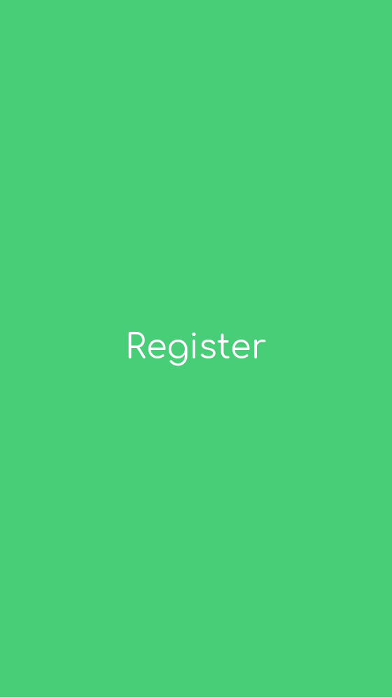
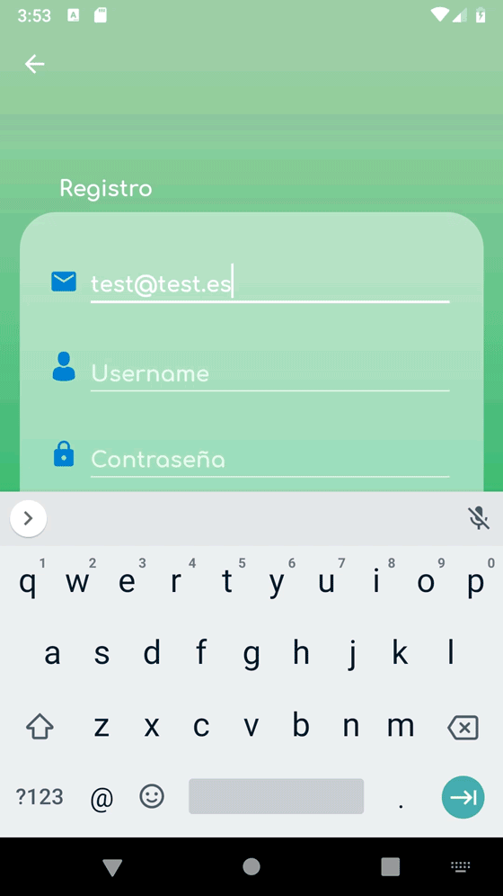
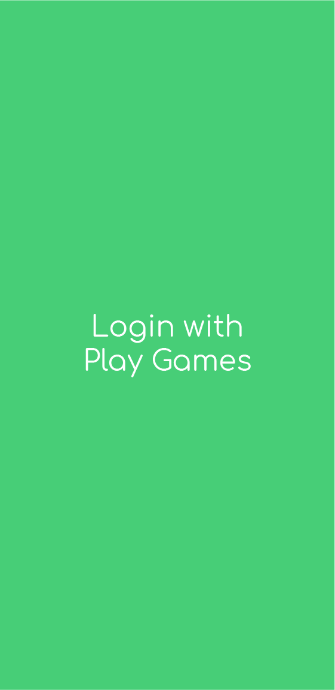

<h1>Chancys game registration demo app</h1>
<h2>Android (Kotlin)</h2>
<b>Main tools</b>
<ul>
<li>Firebase Authentication</li>
  <ul>
    <li>Mail Authentication</li>
    <li>Google Play Games Authentication</li>
  </ul>
<li>Firebase realtime database</li>
<li>Gesture Detector</li>
</ul>

<h1>Description</h1>

This app is an upgraded version of this: https://github.com/Penrech/SharedPreferences_Game . Basically adds user authentification and a fully integration of Firebase both local and external

In order to use Firebase "locally" I use its tool KeepSynced which makes a cached copy of selected elements of the online database

The design was also changed a bit to armonizate more the colors, by the way it's still too greenish

I've decided to make an other repo more than a new branch on the old repo because I've want to keep two different aproaches of the app. One with local database (which could be upgrated to SQL in the future) and Firebase,
and the other one just with Firebase

The change from previous repo local database is not fully tested on the functionality of the game and, as I always end with, its just a demo which may have errors not debug yet

Academic demo app, this app is not completely debugged, it's just a demo. It could contain not extracted text strings and not properly indented code

<h1>Screenshots</h1>

  
  
  

<h1>Demo *</h1>

*A higher quality and longer video opens on YouTube when clicked

  
  

 

  
  

 

  
   

<h1>License</h1>

This repo acts like a portfolio and the app contained here <b>can't hold liability neither place warranty</b>. Furthermore, the final porpouse of this app is not decided yet, so in order to avoid problems in the future this repo has a <b>NonCommercial</b> CC-BY-NC license

 This work is licensed under a <a rel="license" href="http://creativecommons.org/licenses/by-nc-nd/4.0/">Creative Commons Attribution-NonCommercial-NoDerivatives 4.0 International License</a>.
